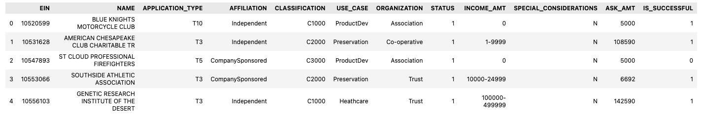

# deep-learning-challenge
Deep Learning - UNC Chapel Hill Bootcamp Module 21 Challenge
## Overview of the Analysis

**Purpose:**  
This analysis aims to develop a neural network model to predict the success of organizations funded by Alphabet Soup. Using features derived from the organization's applications, the model will identify patterns that indicate whether an organization will be successful.

## Results

### Data Preprocessing

- **Target Variable(s):** 
  - The target variable for our model is `IS_SUCCESSFUL`, which indicates whether the funding was used effectively.

- **Feature Variable(s):**
  - The features for the model include application types, affiliations, classifications, use cases, organization types, and income amounts.

- **Variables Removed:**
  - The `EIN` (Employer Identification Number) and `NAME` columns were removed as they are identifiers and do not contribute to the predictive power of the model.

- **Unique Value Analysis:**
  - The number of unique values in each column was determined to identify categorical variables for encoding.

- **Binning Rare Categorical Variables:**
  - Application types and classifications with low occurrence were binned into an "Other" category to reduce dimensionality and improve model performance.

- **Encoding Categorical Variables:**
  - Categorical variables were encoded using `pd.get_dummies()`.

- **Data Splitting:**
  - The preprocessed data was split into feature (`X`) and target (`y`) sets, which were then divided into training and testing datasets.

- **Feature Scaling:**
  - A `StandardScaler` was applied to scale the feature data, making it more suitable for neural network training.

#### Preprocessing Summary

1. **What variable(s) are the target(s) for your model?**
- The target variable for the model is `IS_SUCCESSFUL`. This variable indicates whether the funding provided to an organization was used effectively.

2. **What variable(s) are the features for your model?**
- The features for the model include:
    - `APPLICATION_TYPE`: The type of application submitted.
    - `AFFILIATION`: The affiliation of the organization.
    - `CLASSIFICATION`: The classification of the organization.
    - `USE_CASE`: The use case for the funding.
    - `ORGANIZATION`: The type of organization.
    - `INCOME_AMT`: The income amount category for the organization.
    - Additionally, after encoding, several other binary variables derived from the categorical features mentioned above.

3. **What variable(s) should be removed from the input data because they are neither targets nor features?**
- The variables `EIN` (Employer Identification Number) and `NAME` were removed. These are identification variables and do not contribute to the predictive power of the model.

### Compiling, Training, and Evaluating the Model

- **Model Architecture:**
  - The neural network consists of two hidden layers with 80 and 30 neurons, respectively, and uses the "relu" activation function. The output layer uses the "sigmoid" activation function for binary classification.

- **Model Summary:**
  - The model's structure, including the number of parameters in each layer, was summarized.

- **Model Compilation:**
  - The model was compiled with the Adam optimizer and binary crossentropy loss function.

- **Training:**
  - The model was trained on the scaled dataset for 100 epochs, with a batch size of 1. A callback was used to save the model's weights every five epochs.

- **Evaluation:**
  - Post-training, the model was evaluated on the test dataset, resulting in a loss of `0.5682710409164429` and an accuracy of `0.7279300093650818`.

- **Model Saving:**
  - The final model was saved as "AlphabetSoupCharity.h5" for future use.

#### Model Summary

1. **How many neurons, layers, and activation functions did you select for your neural network model, and why?**
   - The initial model consisted of two hidden layers. The first hidden layer had 80 neurons, and the second had 30 neurons. Both used the "relu" activation function. The output layer used a "sigmoid" activation function, suitable for binary classification tasks. This architecture was chosen to provide the model with sufficient complexity to learn from the data without being overly complex, which might lead to overfitting.

2. **Were you able to achieve the target model performance?**
   - The target model performance, set at 75% accuracy, was not achieved. The accuracy obtained was approximately 72.79%.

3. **What steps did you take in your attempts to increase model performance?**
   - Several optimization strategies were attempted:
     - Increasing the number of neurons in hidden layers.
     - Adding an additional hidden layer to the model.
     - Changing the activation function from "relu" to "tanh" in the hidden layers.
     - Increasing the number of training epochs.
     - Dropping less important features based on feature importance analysis.
     - Utilizing Keras Tuner for hyperparameter tuning.
   
   These approaches are discussed in detail in the next section.
## Model Optimization

In the optimization phase of the project, several strategies were employed to improve the model's performance. The goal was to surpass 75% accuracy.

### Optimization Approaches

1. **Increased Neurons in Hidden Layers:**
   - First, the model was adjusted to have more neurons in the hidden layers (120 neurons in the first layer and 80 in the second). This was an attempt to give the model more capacity to learn complex patterns in the data.

2. **Additional Hidden Layer:**
   - Another model was tested by adding an extra hidden layer, increasing the depth of the network. This was done to see if a deeper model could capture more complex relationships in the data.

3. **Change in Activation Function:**
   - A variation of the model used the `tanh` activation function instead of `relu` in the hidden layers. This was an experiment to see if a different activation function would impact the model's performance.

4. **Increased Number of Epochs:**
   - The number of training epochs was increased for another model, allowing the training process more time to converge and possibly leading to better performance.

5. **Dropping Less Important Features:**
   - Based on feature importance derived from a Random Forest Classifier, less important features were dropped from the dataset. This approach aimed to reduce noise and focus the model on more relevant data.

6. **Hyperparameter Tuning with Keras Tuner:**
   - Keras Tuner was employed to find the best combination of hyperparameters, including the number of neurons, number of layers, and the activation function. This automated approach sought to find the most optimal settings for the neural network.

### Evaluation of Optimization Strategies

Each of these optimization strategies was evaluated based on the model's loss and accuracy on the test data. The results were as follows:

- **Model with More Neurons:**
  - Loss: `0.5603965520858765`, Accuracy: `0.7250145673751831`

- **Model with Additional Layer:**
  - Loss: `0.5664392113685608`, Accuracy: `0.7238484025001526`

- **Model with Tanh Activation Function:**
  - Loss: `0.5541473627090454`, Accuracy: `0.7251312136650085`

- **Model with More Epochs:**
  - Loss: `0.5979912877082825`, Accuracy: `0.7259474992752075`

- **Model with Dropped Features:**
  - Loss: `0.5562112331390381`, Accuracy: `0.7244315147399902`

- **Keras Tuner Optimized Model:**
  - Loss: `0.562475860118866`, Accuracy: `0.7255976796150208`

### Conclusion

Despite these various attempts to optimize the model, achieving the desired accuracy above 75% was challenging. Each approach offered insights into model performance and adjustments, but none significantly outperformed the baseline model. Further exploration and experimentation with data preprocessing, network architecture, and training strategies may be required to achieve the target accuracy.

### Summary of Model Results

The initial and optimized neural network models demonstrated consistent performance, with accuracies hovering around 72.5%. Although various optimization strategies were employed, including adjusting the number of neurons, adding layers, changing activation functions, and even employing hyperparameter tuning with Keras Tuner, the models did not achieve the targeted 75% accuracy. This outcome suggests potential limitations within the dataset or the complexity of the problem itself.

- The baseline model, with two hidden layers, achieved an accuracy of approximately 72.8%.
- Optimization efforts showed marginal differences in performance, with the highest accuracy being around 72.6%.
- The most significant insight from these optimization attempts is the robustness of the model against overfitting and its consistent performance across different architectures and parameters.

### Alternative Modeling Approach: Random Forest Classifier

When considering alternative approaches to neural networks for the Alphabet Soup dataset, the **Random Forest Classifier** emerges as a particularly suitable choice. Here's why this model stands out:

#### Why Random Forest?

1. **Robustness to Overfitting:**
   - Random Forest, being an ensemble of decision trees, is less prone to overfitting compared to a single decision tree. This is due to its method of averaging multiple trees, which balances out biases.

2. **Handling Various Data Types:**
   - This model is effective in handling datasets with a mix of categorical and numerical features, like the Alphabet Soup dataset.

3. **Feature Importance Analysis:**
   - Random Forest provides valuable insights into which features are most influential in predicting the outcome, which is essential for understanding the driving factors behind an organization's success.

4. **Good Performance with Default Parameters:**
   - Even without extensive tuning, Random Forest tends to perform reasonably well.

5. **Flexibility:**
   - It works well for both classification and regression tasks and can handle large datasets effectively.

## Sources
- [Alphabet Soup Charity Data](https://static.bc-edx.com/data/dl-1-2/m21/lms/starter/charity_data.csv)
- [TensorFlow Documentation](https://www.tensorflow.org/api_docs)
- [Keras Documentation](https://keras.io/api/)
- [Scikit-Learn Documentation](https://scikit-learn.org/stable/user_guide.html)
- [Keras Tuner Documentation](https://keras-team.github.io/keras-tuner/)
- [Random Forest Classifier](https://builtin.com/data-science/random-forest-algorithm)
- [Pandas Documentation](https://pandas.pydata.org/docs/)

## References
- [RS. Tax Exempt Organization Search Bulk Data Downloads](https://www.irs.gov/charities-non-profits/tax-exempt-organization-search-bulk-data-downloads)